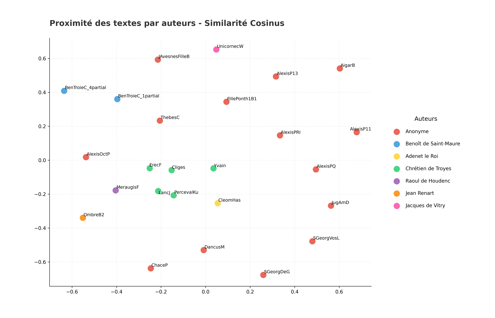

## Analyse par Auteurs
*Généré le : 2026-04-01 10:32*

Citation: (2018). Open Medieval French. https://github.com/OpenMedFr/texts

==================================================

### 1. Classification KNN 

**Précision de l'algorithme KNN (cosinus) : 36.0%**

#### Les 5 paires les plus proches : 
- **0.7465** : LancJ (Chrétien de Troyes) / PercevalKu (Chrétien de Troyes)
- **0.7119** : Cliges (Chrétien de Troyes) / LancJ (Chrétien de Troyes)
- **0.6902** : LancJ (Chrétien de Troyes) / ErecF (Chrétien de Troyes)
- **0.6847** : Cliges (Chrétien de Troyes) / PercevalKu (Chrétien de Troyes)
- **0.6814** : Cliges (Chrétien de Troyes) / ErecF (Chrétien de Troyes)

### Les 5 paires les plus éloignées :
- **0.0165** : ChaceP (Anonyme) / AigarB (Anonyme)
- **0.0180** : AlexisP13 (Anonyme) / AigarB (Anonyme)
- **0.0183** : AigarB (Anonyme) / JugAmD (Anonyme)
- **0.0190** : AigarB (Anonyme) / UnicornecW (Jacques de Vitry)
- **0.0190** : SGeorgDeG (Anonyme) / AigarB (Anonyme)

==================================================

### 2. Cohésion interne

- **Chrétien de Troyes** : 0.6289 (Similarité moyenne)
- **Anonyme** : 0.1299 (Similarité moyenne)
- **Benoît de Saint-Maure** : 0.3276 (Similarité moyenne)
- **Raoul de Houdenc** : *Non calculable (1 seul texte)*
- **Adenet le Roi** : *Non calculable (1 seul texte)*
- **Jean Renart** : *Non calculable (1 seul texte)*
- **Jacques de Vitry** : *Non calculable (1 seul texte)*

==================================================

### 3. Ngrammes signatures

#### Signature : 'Adenet le Roi' 

- 'à ce' (ratio : 103.68)
- 'pour ce' (ratio : 98.40)
- 'car moult' (ratio : 95.04)
- 'et à' (ratio : 92.31)
- 'de là' (ratio : 84.00)

#### Signature : 'Anonyme' 

- 'li quens' (ratio : 4.26)
- 'par mé' (ratio : 3.21)
- 'le rei' (ratio : 3.10)
- 'li pére' (ratio : 3.07)
- 'conte de' (ratio : 3.02)

#### Signature : 'Benoît de Saint-Maure' 

- 'e de' (ratio : 31.70)
- 'e mout' (ratio : 21.50)
- 'e plus' (ratio : 18.50)
- 'e si' (ratio : 18.33)
- 'de troie' (ratio : 16.19)

#### Signature : 'Chrétien de Troyes' 

- 'messire gauvains' (ratio : 29.40)
- 'an la' (ratio : 29.04)
- 'la reïne' (ratio : 26.15)
- 'vos an' (ratio : 25.80)
- 'si con' (ratio : 22.61)

#### Signature : 'Jacques de Vitry' 

- 'cou est' (ratio : 4.00)
- 'li biel' (ratio : 4.00)
- 'la bieste' (ratio : 4.00)
- 'tous iours' (ratio : 4.00)
- 'la falise' (ratio : 3.84)

#### Signature : 'Jean Renart' 

- 'por qoi' (ratio : 4.80)
- 'a ami' (ratio : 4.62)
- 'onques mès' (ratio : 4.00)
- 'fet ele' (ratio : 3.91)
- 'son doit' (ratio : 3.84)

#### Signature : 'Raoul de Houdenc' 

- 'meraugis qui' (ratio : 25.00)
- 'sen vet' (ratio : 19.20)
- 'por quoi' (ratio : 17.33)
- 'et meraugis' (ratio : 14.00)
- 'li lois' (ratio : 12.00)

==================================================

### 4. Visualisation

