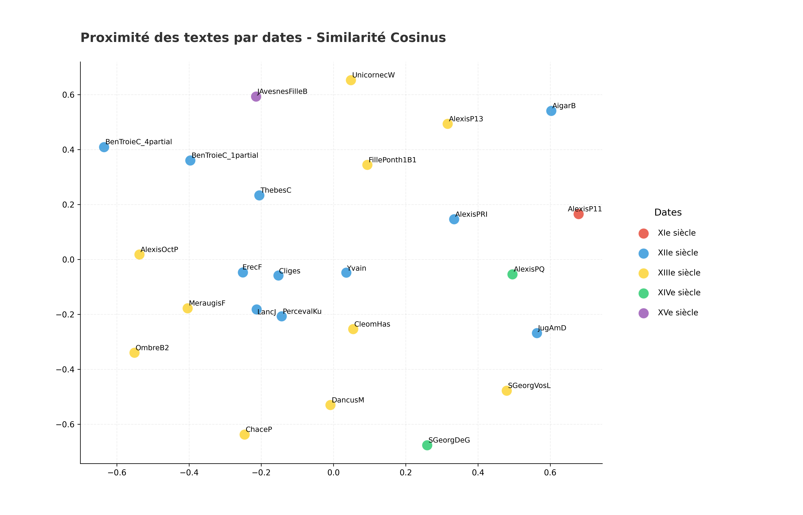

## Analyse par Époques
*Généré le : 2026-04-01 10:32*

Citation: (2018). Open Medieval French. https://github.com/OpenMedFr/texts

==================================================

### 1. Classification KNN 

**Précision de l'algorithme KNN (cosinus) : 48.0%**

#### Les 5 paires les plus proches : 
- **0.7465** : LancJ (XIIe siècle) / PercevalKu (XIIe siècle)
- **0.7119** : Cliges (XIIe siècle) / LancJ (XIIe siècle)
- **0.6902** : LancJ (XIIe siècle) / ErecF (XIIe siècle)
- **0.6847** : Cliges (XIIe siècle) / PercevalKu (XIIe siècle)
- **0.6814** : Cliges (XIIe siècle) / ErecF (XIIe siècle)

### Les 5 paires les plus éloignées :
- **0.0165** : ChaceP (XIIIe siècle) / AigarB (XIIe siècle)
- **0.0180** : AlexisP13 (XIIIe siècle) / AigarB (XIIe siècle)
- **0.0183** : AigarB (XIIe siècle) / JugAmD (XIIe siècle)
- **0.0190** : AigarB (XIIe siècle) / UnicornecW (XIIIe siècle)
- **0.0190** : SGeorgDeG (XIVe siècle) / AigarB (XIIe siècle)

==================================================

### 2. Cohésion interne

- **XIIe siècle** : 0.2835 (Similarité moyenne)
- **XIe siècle** : *Non calculable (1 seul texte)*
- **XIIIe siècle** : 0.1830 (Similarité moyenne)
- **XIVe siècle** : 0.1310 (Similarité moyenne)
- **XVe siècle** : *Non calculable (1 seul texte)*

==================================================

### 3. Ngrammes signatures

#### Signature : 'XIIIe siècle' 

- 'à ce' (ratio : 10.90)
- 'pour ce' (ratio : 10.40)
- 'et à' (ratio : 10.20)
- 'car moult' (ratio : 9.28)
- 'et moult' (ratio : 9.00)

#### Signature : 'XIIe siècle' 

- 'li reis' (ratio : 30.91)
- 'la reïne' (ratio : 24.44)
- 'an la' (ratio : 14.34)
- 'messire gauvains' (ratio : 13.36)
- 'le rei' (ratio : 12.81)

#### Signature : 'XIVe siècle' 

- 'saint george' (ratio : 14.00)
- 'jhesu crist' (ratio : 8.02)
- 'dous jhesu' (ratio : 5.50)
- 'sains hons' (ratio : 5.00)
- 'a dieu' (ratio : 4.88)

#### Signature : 'XIe siècle' 

- 'la citet' (ratio : 15.00)
- 'li pedre' (ratio : 12.00)
- 'qued il' (ratio : 10.00)
- 'la medre' (ratio : 9.00)
- 'la pulcele' (ratio : 8.00)

#### Signature : 'XVe siècle' 

- 'de pontieu' (ratio : 31.38)
- 'conte de' (ratio : 25.30)
- 'de dommart' (ratio : 14.00)
- 'de dommarc' (ratio : 13.00)
- 'de grenalde' (ratio : 12.00)

==================================================

### 4. Visualisation

