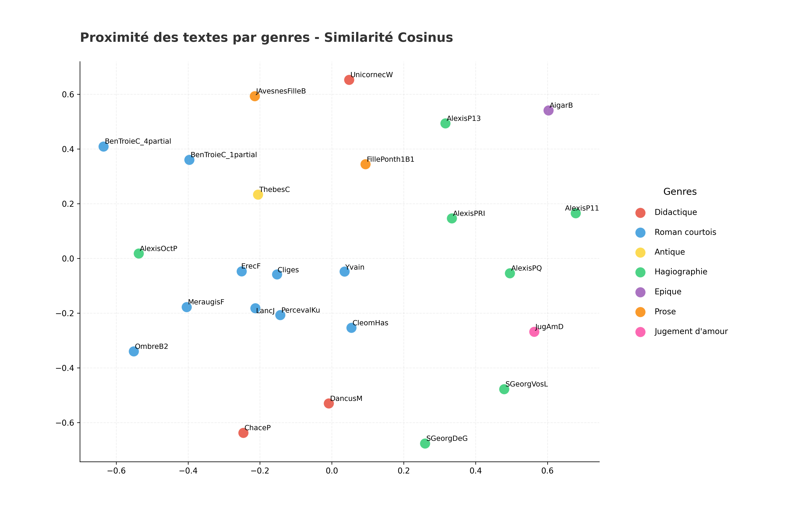

## Analyse par Genres Littéraires
*Généré le : 2026-04-01 10:32*

Citation: (2018). Open Medieval French. https://github.com/OpenMedFr/texts

==================================================

### 1. Classification KNN 

**Précision de l'algorithme KNN (cosinus) : 48.0%**

#### Les 5 paires les plus proches : 
- **0.7465** : LancJ (Roman courtois) / PercevalKu (Roman courtois)
- **0.7119** : Cliges (Roman courtois) / LancJ (Roman courtois)
- **0.6902** : LancJ (Roman courtois) / ErecF (Roman courtois)
- **0.6847** : Cliges (Roman courtois) / PercevalKu (Roman courtois)
- **0.6814** : Cliges (Roman courtois) / ErecF (Roman courtois)

### Les 5 paires les plus éloignées :
- **0.0165** : ChaceP (Didactique) / AigarB (Epique)
- **0.0180** : AlexisP13 (Hagiographie) / AigarB (Epique)
- **0.0183** : AigarB (Epique) / JugAmD (Jugement d'amour)
- **0.0190** : AigarB (Epique) / UnicornecW (Didactique)
- **0.0190** : SGeorgDeG (Hagiographie) / AigarB (Epique)

==================================================

### 2. Cohésion interne

- **Roman courtois** : 0.3854 (Similarité moyenne)
- **Hagiographie** : 0.1392 (Similarité moyenne)
- **Antique** : *Non calculable (1 seul texte)*
- **Prose** : 0.2108 (Similarité moyenne)
- **Didactique** : 0.1792 (Similarité moyenne)
- **Epique** : *Non calculable (1 seul texte)*
- **Jugement d'amour** : *Non calculable (1 seul texte)*

==================================================

### 3. Ngrammes signatures

#### Signature : 'Antique' 

- 'le rei' (ratio : 65.87)
- 'li reis' (ratio : 54.00)
- 'par mé' (ratio : 45.00)
- 'mé le' (ratio : 32.00)
- 'al rei' (ratio : 29.68)

#### Signature : 'Didactique' 

- 'tu voiz' (ratio : 6.00)
- 'quant tu' (ratio : 5.97)
- 'li done' (ratio : 4.70)
- 'char de' (ratio : 4.67)
- 'le met' (ratio : 4.62)

#### Signature : 'Epique' 

- 'lo reis' (ratio : 10.00)
- 'e lo' (ratio : 8.00)
- 'reis es' (ratio : 5.76)
- 'sos fils' (ratio : 5.00)
- 'a tubie' (ratio : 5.00)

#### Signature : 'Hagiographie' 

- 'li sains' (ratio : 5.43)
- 'ne l' (ratio : 5.14)
- 'li pére' (ratio : 4.90)
- 'dist il' (ratio : 4.00)
- 'saint george' (ratio : 4.00)

#### Signature : 'Jugement d'amour' 

- 'li rousingnols' (ratio : 6.00)
- 'de cortoisie' (ratio : 5.76)
- 'de deduit' (ratio : 5.54)
- 'clerc ne' (ratio : 5.54)
- 'que clerc' (ratio : 4.00)

#### Signature : 'Prose' 

- 'li quens' (ratio : 31.15)
- 'de pontieu' (ratio : 18.00)
- 'mesire tiebaus' (ratio : 13.50)
- 'conte de' (ratio : 13.14)
- 'li qens' (ratio : 11.00)

#### Signature : 'Roman courtois' 

- 'li rois' (ratio : 29.23)
- 'que je' (ratio : 18.84)
- 'le roi' (ratio : 17.74)
- 'ce que' (ratio : 16.50)
- 'la reïne' (ratio : 15.39)

==================================================

### 4. Visualisation

