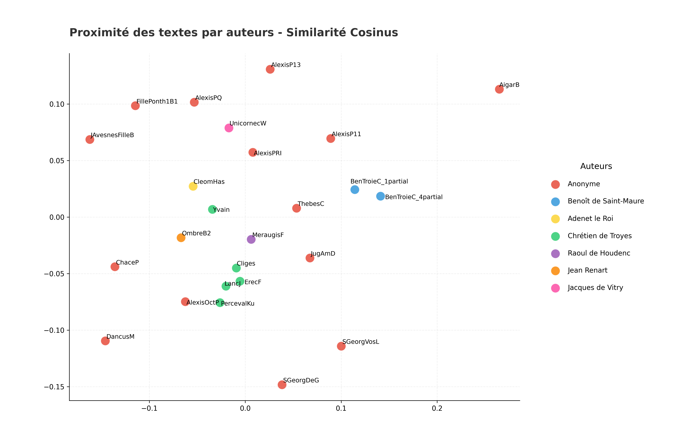

## Analyse par Auteurs
*Généré le : 2026-04-01 09:28*

Citation: (2018). Open Medieval French. https://github.com/OpenMedFr/texts

==================================================

### 1. Classification KNN 

**Précision de l'algorithme KNN : 60.0%**

#### Les 5 paires les plus proches : 
- **0.9824** : LancJ (Chrétien de Troyes) / PercevalKu (Chrétien de Troyes)
- **0.9797** : Cliges (Chrétien de Troyes) / LancJ (Chrétien de Troyes)
- **0.9736** : LancJ (Chrétien de Troyes) / ErecF (Chrétien de Troyes)
- **0.9732** : Cliges (Chrétien de Troyes) / ErecF (Chrétien de Troyes)
- **0.9715** : PercevalKu (Chrétien de Troyes) / ErecF (Chrétien de Troyes)

### Les 5 paires les plus éloignées :
- **0.6170** : AigarB (Anonyme) / DancusM (Anonyme)
- **0.6409** : ChaceP (Anonyme) / AigarB (Anonyme)
- **0.6453** : FillePonth1B1 (Anonyme) / AigarB (Anonyme)
- **0.6474** : AigarB (Anonyme) / JAvesnesFilleB (Anonyme)
- **0.6485** : SGeorgDeG (Anonyme) / AigarB (Anonyme)

==================================================

### 2. Cohésion interne

- **Chrétien de Troyes** : 0.9493
- **Anonyme** : 0.8017
- **Benoît de Saint-Maure** : 0.9586
- **Raoul de Houdenc** : *Non calculable (1 seul texte)*
- **Adenet le Roi** : *Non calculable (1 seul texte)*
- **Jean Renart** : *Non calculable (1 seul texte)*
- **Jacques de Vitry** : *Non calculable (1 seul texte)*

==================================================

### 3. Ngrammes signatures

#### Signature : 'Adenet le Roi' 

- 'léo' (ratio : 735.00)
- 'éom' (ratio : 735.00)
- 'clé' (ratio : 454.77)
- 'adè' (ratio : 452.09)
- '
à ' (ratio : 337.45)

#### Signature : 'Anonyme' 

- 'ére' (ratio : 54.09)
- 'iér' (ratio : 21.15)
- 'ke ' (ratio : 20.73)
- 'èle' (ratio : 13.82)
- 'pér' (ratio : 13.62)

#### Signature : 'Benoît de Saint-Maure' 

- ' e ' (ratio : 70.78)
- '
e ' (ratio : 36.61)
- 'ënt' (ratio : 27.69)
- 'poë' (ratio : 22.57)
- 'iën' (ratio : 21.50)

#### Signature : 'Chrétien de Troyes' 

- 'anb' (ratio : 92.46)
- 'ax ' (ratio : 72.67)
- 'nbl' (ratio : 56.89)
- '
qa' (ratio : 44.60)
- 'an ' (ratio : 43.30)

#### Signature : 'Jacques de Vitry' 

- 'iou' (ratio : 8.37)
- ' vn' (ratio : 7.00)
- 'vne' (ratio : 4.97)
- ' io' (ratio : 4.86)
- 'ouu' (ratio : 4.80)

#### Signature : 'Jean Renart' 

- 'mès' (ratio : 12.61)
- 'qul' (ratio : 12.44)
- '
mè' (ratio : 9.91)
- ' mè' (ratio : 7.78)
- 'nss' (ratio : 7.67)

#### Signature : 'Raoul de Houdenc' 

- 'aug' (ratio : 41.51)
- 'ugi' (ratio : 40.00)
- 'rau' (ratio : 32.33)
- 'elc' (ratio : 31.38)
- 'gis' (ratio : 22.10)

==================================================

### 4. Visualisation

==================================================
## 5. LCS - Séquences récurrentes de Chrétien de Troyes 

Séquences de mots exactes partagées entre ses oeuvres : 

- **Yvain** et **LancJ** (32 caractères) :
 > «  *il a onques voir tant ne savilla* »

- **Yvain** et **Cliges** (19 caractères) :
 > «  *au plus tost que il* »

- **Yvain** et **PercevalKu** (46 caractères) :
 > «  *armer son cors et son cheval li ont trait fors* »

- **Yvain** et **ErecF** (23 caractères) :
 > «  *au plus tost que il pot* »

- **LancJ** et **Cliges** (33 caractères) :
 > «  *toche et a ses ialz et a sa boche* »

- **LancJ** et **PercevalKu** (39 caractères) :
 > «  *le roi artu foi que doi deu et sa vertu* »

- **LancJ** et **ErecF** (47 caractères) :
 > «  *que laube crieve isnelemant et tost se lieve et* »

- **Cliges** et **PercevalKu** (26 caractères) :
 > «  *la ou il ert an son esgart* »

- **Cliges** et **ErecF** (32 caractères) :
 > «  *et haut et bas et povre et riche* »

- **PercevalKu** et **ErecF** (45 caractères) :
 > «  *et bele et sage et si est mout de haut parage* »
