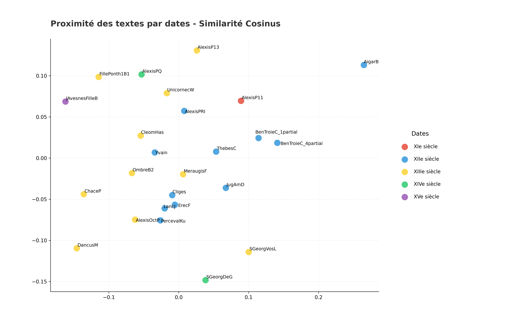

## Analyse par Epoques
*Généré le : 2026-03-25 10:19*

Citation: (2018). Open Medieval French. https://github.com/OpenMedFr/texts

==================================================

### 1. Classification KNN 

**Précision de l'algorithme KNN : 52.0%**

#### Les 5 paires les plus proches : 
- **0.9824** : LancJ (XIIe siècle) / PercevalKu (XIIe siècle)
- **0.9797** : Cliges (XIIe siècle) / LancJ (XIIe siècle)
- **0.9736** : LancJ (XIIe siècle) / ErecF (XIIe siècle)
- **0.9732** : Cliges (XIIe siècle) / ErecF (XIIe siècle)
- **0.9715** : PercevalKu (XIIe siècle) / ErecF (XIIe siècle)

### Les 5 paires les plus éloignées :
- **0.6170** : AigarB (XIIe siècle) / DancusM (XIIIe siècle)
- **0.6409** : ChaceP (XIIIe siècle) / AigarB (XIIe siècle)
- **0.6453** : FillePonth1B1 (XIIIe siècle) / AigarB (XIIe siècle)
- **0.6474** : AigarB (XIIe siècle) / JAvesnesFilleB (XVe siècle)
- **0.6485** : SGeorgDeG (XIVe siècle) / AigarB (XIIe siècle)

==================================================

### 2. Cohésion interne

- **XIIe siècle** : 0.8551
- **XIe siècle** : *Non calculable (1 seul texte)*
- **XIIIe siècle** : 0.8335
- **XIVe siècle** : 0.8763
- **XVe siècle** : *Non calculable (1 seul texte)*

==================================================

### 3. Ngrammes signatures

#### Signature : 'XIIIe siècle' 

- ' à ' (ratio : 109.17)
- 'éom' (ratio : 73.50)
- 'léo' (ratio : 73.50)
- '
à ' (ratio : 44.25)
- 'adè' (ratio : 43.71)

#### Signature : 'XIIe siècle' 

- 'anb' (ratio : 40.33)
- 'eis' (ratio : 30.96)
- 'ax ' (ratio : 30.83)
- 'ïne' (ratio : 28.64)
- 'nbl' (ratio : 27.36)

#### Signature : 'XIVe siècle' 

- 'geo' (ratio : 15.22)
- 'jhe' (ratio : 10.62)
- ' jh' (ratio : 9.73)
- 'xis' (ratio : 7.22)
- 'ay ' (ratio : 6.94)

#### Signature : 'XIe siècle' 

- 'edr' (ratio : 33.33)
- 'ped' (ratio : 24.86)
- 'ed ' (ratio : 14.22)
- 'at ' (ratio : 10.69)
- 'd i' (ratio : 10.50)

#### Signature : 'XVe siècle' 

- 'uld' (ratio : 65.14)
- 'ld ' (ratio : 56.00)
- 'hib' (ratio : 54.00)
- 'luy' (ratio : 48.00)
- 'uy ' (ratio : 48.00)

==================================================

### 4. Visualisation

