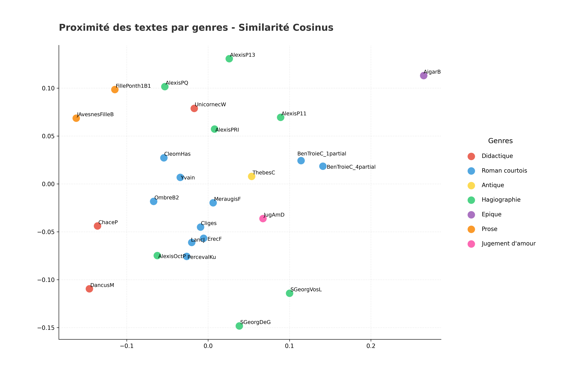

## Analyse par Genres Littéraires
- *Généré le : 2026-03-23 16:06*

### 1. Classification KNN 

**Précision de l'algorithme KNN : 52.0%**

#### Les 5 paires les plus proches : 
- **0.9824** : LancJ (Roman courtois) / PercevalKu (Roman courtois)
- **0.9797** : Cliges (Roman courtois) / LancJ (Roman courtois)
- **0.9736** : LancJ (Roman courtois) / ErecF (Roman courtois)
- **0.9732** : Cliges (Roman courtois) / ErecF (Roman courtois)
- **0.9715** : PercevalKu (Roman courtois) / ErecF (Roman courtois)

### Les 5 paires les plus éloignées :
- **0.6170** : AigarB (Epique) / DancusM (Didactique)
- **0.6409** : ChaceP (Didactique) / AigarB (Epique)
- **0.6453** : FillePonth1B1 (Prose) / AigarB (Epique)
- **0.6474** : AigarB (Epique) / JAvesnesFilleB (Prose)
- **0.6485** : SGeorgDeG (Hagiographie) / AigarB (Epique)

==================================================

### 2. Cohésion interne

- **Roman courtois** : 0.8909
- **Hagiographie** : 0.8364
- **Antique** : *Non calculable (1 seul texte)*
- **Prose** : 0.8432
- **Didactique** : 0.8159
- **Epique** : *Non calculable (1 seul texte)*
- **Jugement d'amour** : *Non calculable (1 seul texte)*

==================================================

### 3. Ngrammes signatures

#### Signature : 'Antique' 

- 'èle' (ratio : 137.83)
- 'pué' (ratio : 136.32)
- 'tyd' (ratio : 99.84)
- 'icè' (ratio : 74.88)
- 'cès' (ratio : 60.39)

#### Signature : 'Didactique' 

- 'uco' (ratio : 10.83)
- 'juq' (ratio : 7.63)
- 'um ' (ratio : 5.16)
- 'aue' (ratio : 4.14)
- 'am ' (ratio : 3.91)

#### Signature : 'Epique' 

- 'ar
' (ratio : 28.10)
- 'ab ' (ratio : 20.31)
- 'lo ' (ratio : 18.15)
- 'aiq' (ratio : 15.00)
- 's
k' (ratio : 12.88)

#### Signature : 'Hagiographie' 

- 'exi' (ratio : 15.43)
- 'lex' (ratio : 13.43)
- 'xis' (ratio : 12.52)
- 'diu' (ratio : 10.45)
- 'tet' (ratio : 8.92)

#### Signature : 'Jugement d'amour' 

- 'hef' (ratio : 4.62)
- 'efl' (ratio : 3.87)
- 'peg' (ratio : 2.88)
- 'nol' (ratio : 2.62)
- 'flo' (ratio : 2.44)

#### Signature : 'Prose' 

- 'uld' (ratio : 32.37)
- 'ld ' (ratio : 28.00)
- 'uda' (ratio : 27.88)
- 'hib' (ratio : 27.00)
- 'iba' (ratio : 23.82)

#### Signature : 'Roman courtois' 

- 'léo' (ratio : 73.50)
- 'éom' (ratio : 73.50)
- 'mad' (ratio : 60.47)
- 'adè' (ratio : 49.14)
- 'anb' (ratio : 45.15)

==================================================

### 4. Visualisation

